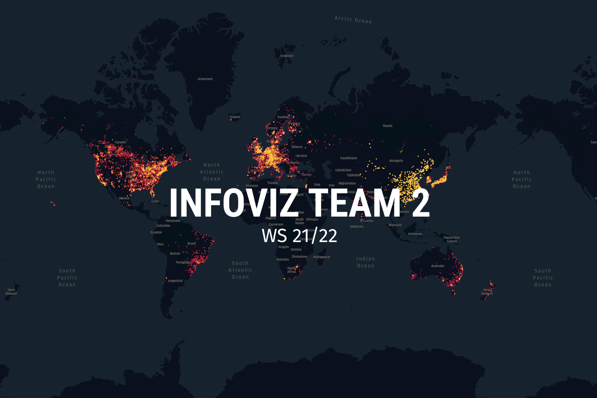

<!-- TABLE OF CONTENTS -->

  
Table of Contents

  <ol>
    <li>
      <a href="#about-the-project">About The Project</a>
      <ul>
        <li><a href="#research-questions">Research Questions</a></li>
        <li><a href="#goals">Goals</a></li>
      </ul>
    </li>
    <li><a href="#roadmap">Roadmap</a></li>
    <li><a href="#feature-list">Feature List</a></li>
    <li><a href="#team">Team</a></li>

  </ol>

<!-- CURRENT LIVE VERSION -->
## Current live version
You can view the current state of the project here:
http://www.cip.ifi.lmu.de/~hubermic/

<!-- ABOUT THE PROJECT -->
## About The Project
This project is built by Team 2 (introduced in <a href="#team">Team</a> ). It is made for the course "Information Visualization" at the LMU.

### Research Questions
Our research questions which we want to answer with our project and visualization:
- Which innovation fields do different EU countries excel at?
- What is the Innovation distribution across the EU?
- What countries are innovation hotspots in the EU?

### Goals
Our goal is to provide an interactive map to compare different European countries in terms of innovation.
1. Two different views: “Overview” and “Country Comparison” (Toogle)
2. On the bottom you can select the innovation sectors you want to compare à on the
top you can see the bar graph of the selected sectors
3. Overview: geographical location of patent data is clustered and represented on the
map with dots (vary in size)
4. Country Comparison: click on two countries to compare only the amount of patents
in certain sectors

<!-- ROADMAP -->
## Roadmap

Our roadmap or milestone plan can be found in our excel-file which is a Gantt Chart.

<!-- FEATURE LIST for milestone 4-->
## Feature List
_(status 01.02.2022)_  
When you open the Website you can see a map on the right and a box with a toggle **("comparison" and "overview")** and 8 different checkboxes

**1. Comparison (start page)**
- You see:
  - Checkboxes for categories
  - Map with selectable countries
  - Help button
- Effect:
	- You have to select 2 countries and minimum one category than you can see a bar chart
	- In the bar chart there are the 2 selected countries in two different colors with their amount of patents in the selected category
- Aim
	- Which innovation fields do different EU countries excel at?
	- What is the Innovation distribution across the EU?
	- What countries are innovation hotspots in the EU?
- Limit
	- Because of the amount of data we reduced it to only 5 countries (Germany, United Kingdom, France, Italy and Switzerland)

**2. Overview**
- You see:
	- Checkboxes for categories
	- Map
	- Slider for year
	- Help button
- Effect
	- You have to select minimum one category
	- Shows all patents in selected year for selected categories in a bar chart and with bubbles (one patent is equivalent to one bubble) on the map for the 5 countries
- Aim
	- Which innovation fields do different EU countries excel at?
	- What is the Innovation distribution across the EU?
	- What countries are innovation hotspots in the EU?
- Limit
	- Because of the amount of data we reduced it to only 5 countries (Germany, United Kingdom, France, Italy and Switzerland)

### Plan/Optional components:
- Mouse over view for the bar chart: when you hover over a bar in the bar chart you can see the number of patents and the corresponding country
- Design options:
	- Different/more colors
	- Text fields, that explain functions
	- Different scale for the map (maybe with a zoom onto selected countries)
	- Improve the slider

<!-- Team and Contact -->
## Team

Our Team:
Team 2

- [Alexander Bünger](mailto:Ed.Buenger@campus.lmu.de)
- [Michael Huber](mailto:mi.huber@campus.lmu.de)
- [Agnes Reda](mailto:A.Reda@campus.lmu.de)
- [Philipp Thalhammer](mailto:Philipp.Thalhammer@campus.lmu.de)
- [Susanne Weidinger](mailto:s.weidinger@campus.lmu.de)
